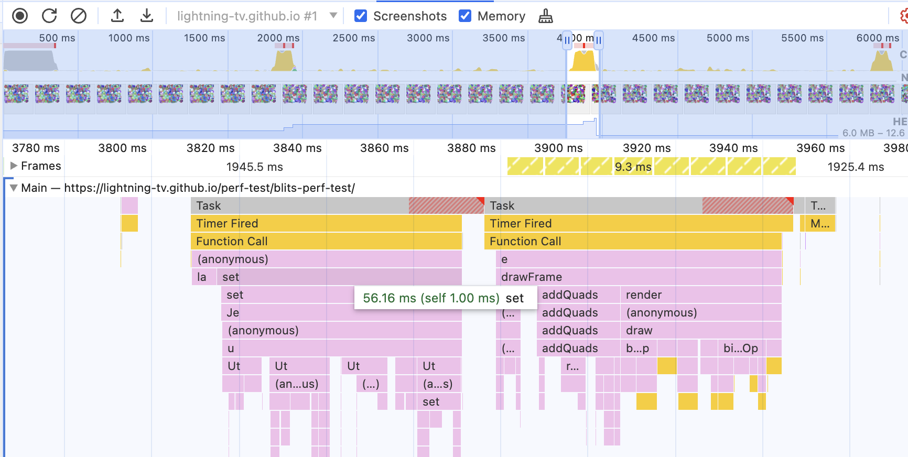
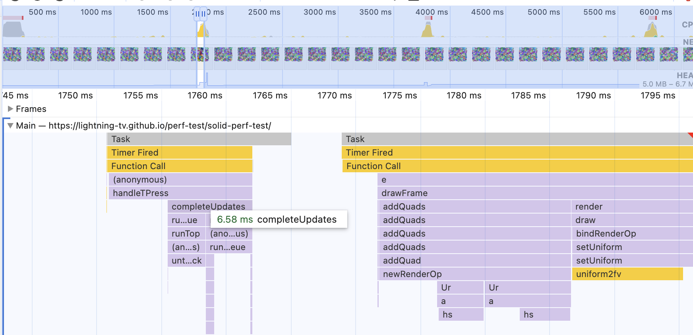
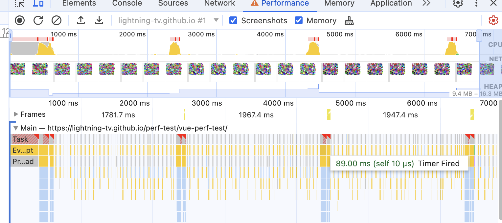

# perf-test

Simple performance test for Blits, Solid and Vue with Lightning 3. Each test creates 1k random nodes every 2 seconds. Simply open the dev tools, go to performance tab, slow down CPU by 20x and click record.

Hosted version: https://lightning-tv.github.io/perf-test/

## Results

Blits: 1160ms

Solid: 65ms

Vue: 89ms
